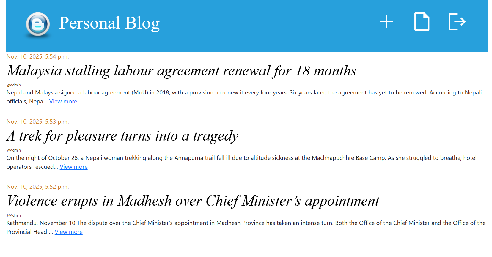
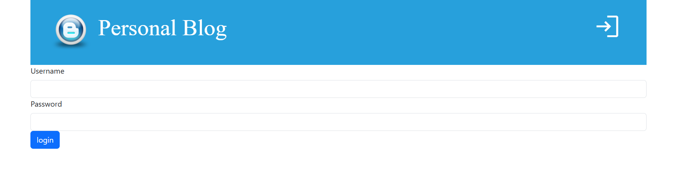
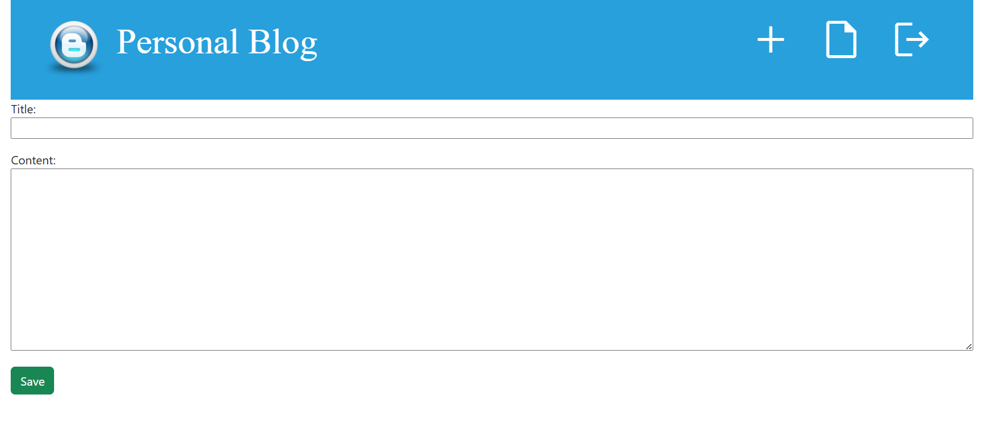
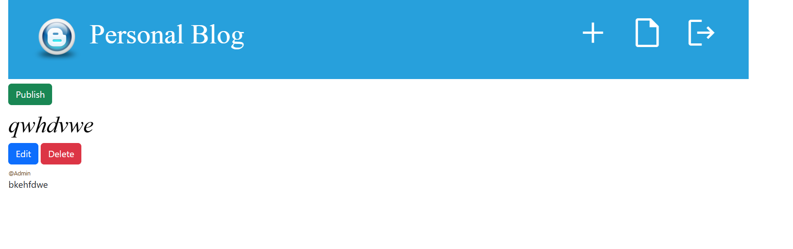

# 📝 Django Blog

A simple and elegant blog application built with Django where you can write, manage, and publish your thoughts.



## ✨ Features

- Write and publish blog posts
- Save drafts for later
- User authentication
- Clean and responsive design

## 🚀 Quick Start

1. **Clone and setup**
```bash
git clone https://github.com/Sadikshya-dhakal/BLOG.git
cd BLOG
python -m venv venv
source venv/bin/activate  # On Windows: venv\Scripts\activate
pip install -r requirements.txt
```

2. **Run the app**
```bash
python manage.py migrate
python manage.py createsuperuser
python manage.py runserver
```

3. **Open** `http://127.0.0.1:8000/` in your browser

## 📸 Screenshots

| Login | Create Post | Manage Drafts |
|-------|-------------|---------------|
|  |  |  |

## 🛠️ Built With

- Django
- SQLite
- HTML/CSS

---

⭐ Star this repo if you found it helpful!

